# MathCom Docker Architecture - Visual Diagrams

This document contains detailed visual diagrams to help understand the Docker architecture of the MathCom web application.

## 1. Complete System Architecture

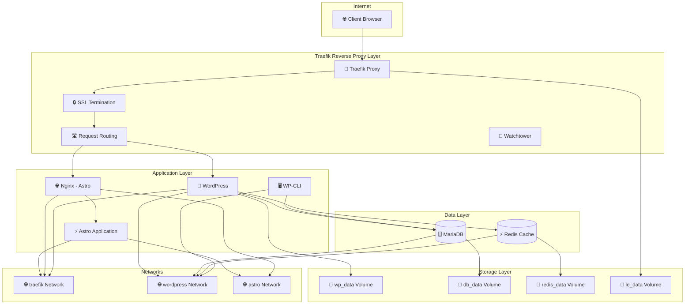

## 2. Production Environment Flow

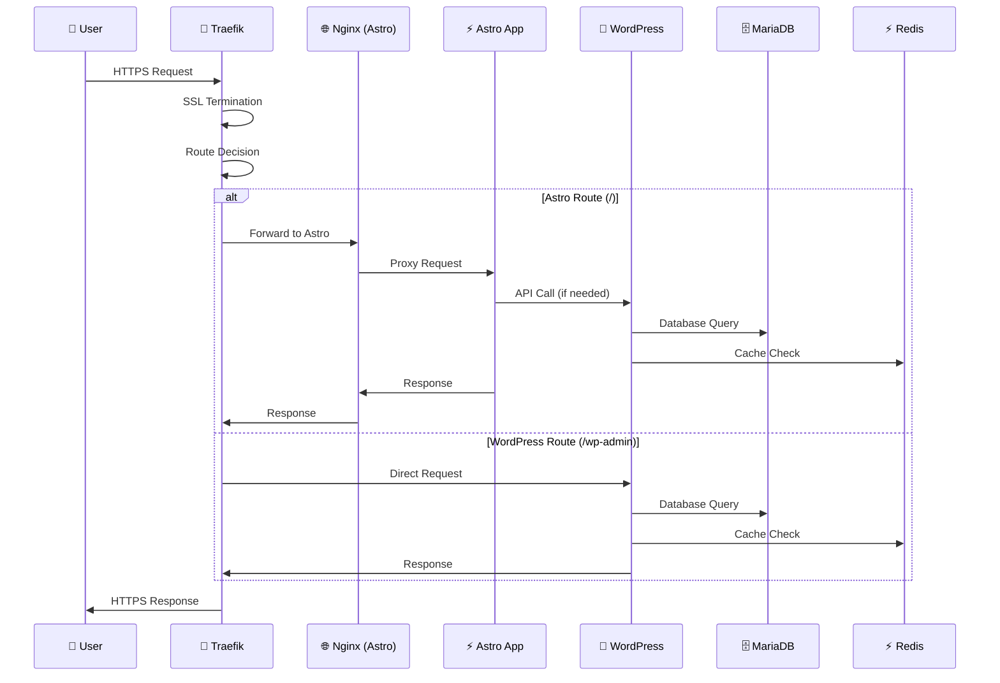

## 3. Network Architecture

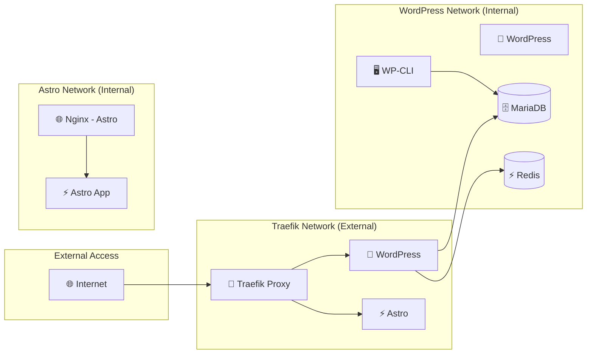

## 4. Data Persistence Architecture

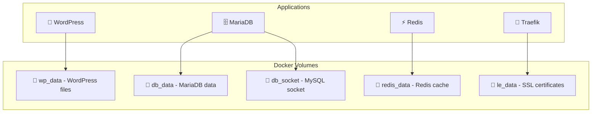

## 5. Service Dependencies

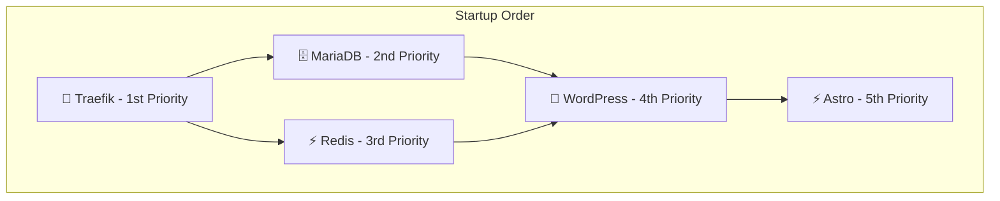

## 6. Security Architecture

```mermaid
graph TB
    subgraph "External Security Layer"
        SSL[🔒 SSL/TLS Termination]
        HTTPS[🔐 HTTPS Enforcement]
        HSTS[🛡️ HSTS Headers]
    end
    
    subgraph "Network Security Layer"
        NS[🌐 Network Segmentation]
        FW[🔥 Firewall Rules]
        IP[📍 Static IP Addressing]
    end
    
    subgraph "Application Security Layer"
        UPD[🔄 Automatic Updates]
        HC[❤️ Health Checks]
        LOG[📝 Access Logging]
    end
    
    SSL --> HTTPS
    HTTPS --> HSTS
    NS --> FW
    FW --> IP
    UPD --> HC
    HC --> LOG
```

## 7. Local Development vs Production

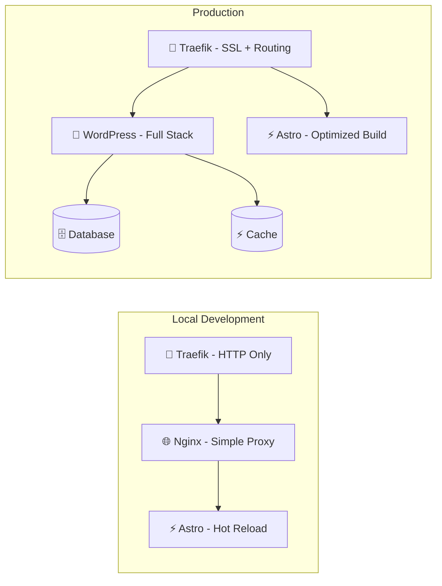

## 8. Monitoring and Health Checks

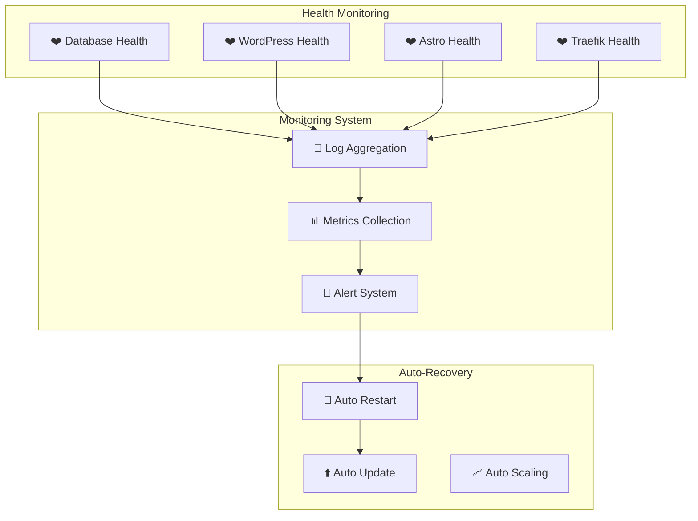

## 9. Deployment Pipeline

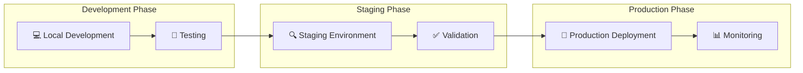

## 10. Troubleshooting Flow

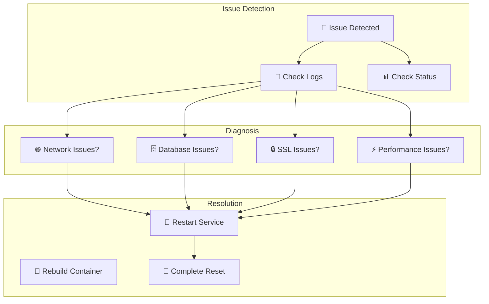

## 11. Environment Variables Architecture

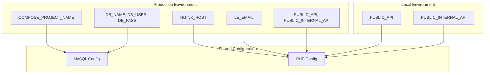

## 12. Container Lifecycle

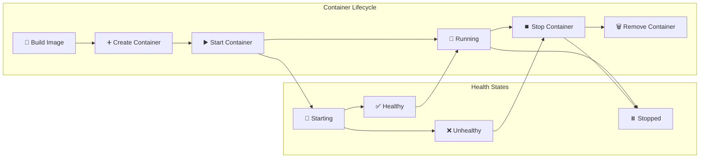

---

## Legend

- 🔄 **Traefik**: Reverse proxy and load balancer
- 📝 **WordPress**: Content management system
- ⚡ **Astro**: Modern static site generator
- 🗄️ **MariaDB**: Database server
- ⚡ **Redis**: Caching layer
- 🌐 **Nginx**: Web server
- 🔒 **SSL**: Security layer
- 📁 **Volumes**: Data persistence
- 🌐 **Networks**: Container communication
- 🖥️ **WP-CLI**: WordPress command line
- 🔄 **Watchtower**: Automatic updates
- ❤️ **Health Checks**: Service monitoring
- 📝 **Logs**: Logging and monitoring
- 🚨 **Alerts**: Alert system
- 🔨 **Build**: Container building
- ▶️ **Start**: Service startup
- ⏹️ **Stop**: Service shutdown 