# MathCom Web Application - Docker Architecture Documentation

## Table of Contents

1. [Overview](#overview)
2. [Architecture Overview](#architecture-overview)
3. [Environment Structure](#environment-structure)
4. [Production Architecture](#production-architecture)
5. [Local Development Architecture](#local-development-architecture)
6. [Archive Architecture](#archive-architecture)
7. [Network Architecture](#network-architecture)
8. [Data Flow](#data-flow)
9. [Security Considerations](#security-considerations)
10. [Deployment Strategy](#deployment-strategy)
11. [Monitoring and Health Checks](#monitoring-and-health-checks)
12. [Troubleshooting Guide](#troubleshooting-guide)

## Overview

The MathCom web application is a multi-service Docker-based architecture that combines:

- **Astro.js** - Modern static site generator for the main website
- **WordPress** - Content management system for dynamic content
- **Traefik** - Reverse proxy and load balancer with automatic SSL
- **MariaDB** - Database backend
- **Redis** - Caching layer
- **Nginx** - Web server and caching

The architecture supports multiple environments:

- **Production** - Full-featured deployment with SSL, caching, and monitoring
- **Local Development** - Simplified setup for development
- **Archive** - Legacy applications and archived content

## Architecture Overview

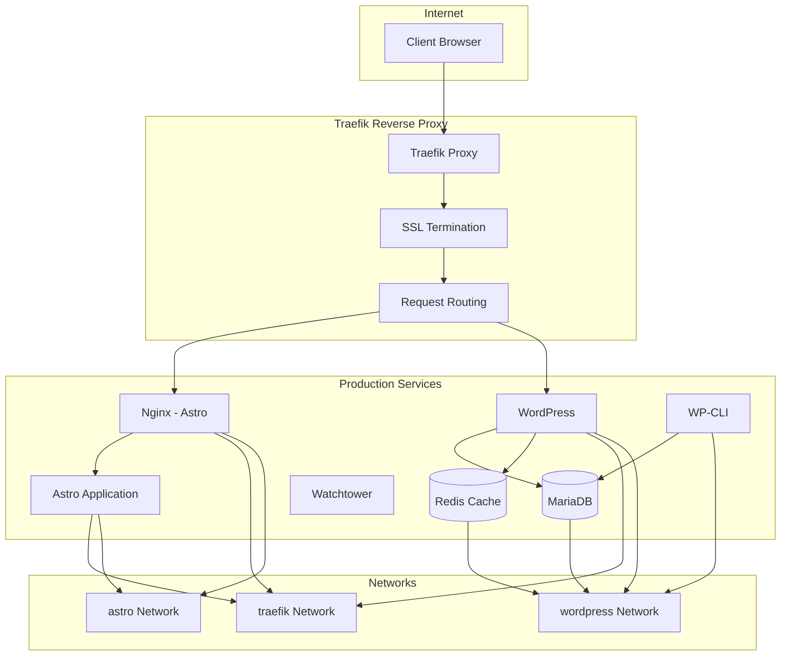

## Environment Structure

```text
docker/
├── local/                          # Local development environment
│   └── docker-compose.yml         # Simplified setup for development
├── production/
│   ├── main/                      # Main production services
│   │   ├── proxy/                 # Traefik reverse proxy
│   │   │   └── docker-compose.yml
│   │   ├── wordpress/             # WordPress CMS stack
│   │   │   ├── docker-compose.yml
│   │   │   ├── nginx/             # Nginx configuration
│   │   │   └── themes/            # Custom WordPress themes
│   │   └── astro/                 # Astro.js application
│   │       ├── docker-compose.yml
│   │       ├── Dockerfile         # Multi-stage build
│   │       └── config/            # Nginx configuration
│   └── archive/                   # Legacy/archived applications
│       └── docker-compose.yml
└── shared/                        # Shared configurations
    ├── mysql/                     # Database configuration
    └── php/                       # PHP configuration
```

## Production Architecture

### Service Stack Overview

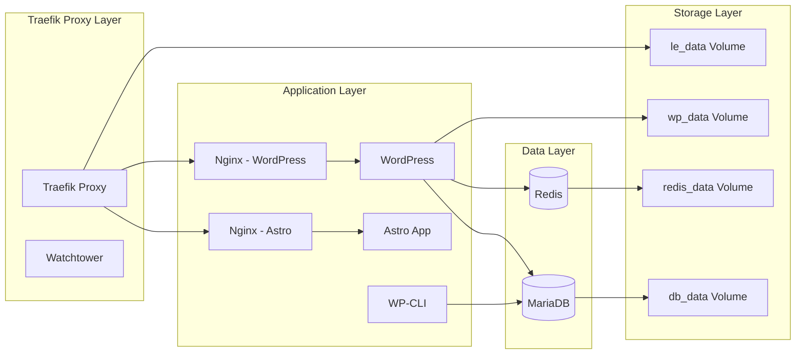

### Detailed Service Breakdown

#### 1. Traefik Proxy (`docker/production/main/proxy/`)

**Purpose**: Reverse proxy, SSL termination, and request routing

**Services**:

- **Traefik**: Main reverse proxy with automatic SSL certificate management
- **Whoami**: Health check service for Traefik
- **Watchtower**: Automatic container updates
- **WWW Redirect**: Redirects www to non-www

**Key Features**:

- Automatic SSL certificate generation via Let's Encrypt
- HTTP to HTTPS redirection
- Request routing based on host and path
- Health monitoring

**Configuration**:

```yaml
# Key Traefik configuration
- --entrypoints.web.address=:80
- --entrypoints.websecure.address=:443
- --certificatesresolvers.le.acme.tlschallenge=true
- --providers.docker.exposedbydefault=false
```

#### 2. WordPress Stack (`docker/production/main/wordpress/`)

**Purpose**: Content management system with database and caching

**Services**:

- **Nginx**: Web server for WordPress with custom configuration
- **WordPress**: PHP-FPM application with custom theme
- **WP-CLI**: WordPress command-line interface
- **MariaDB**: Database server with health checks
- **Redis**: Object caching for WordPress
- **Watchtower**: Automatic updates

**Key Features**:

- Custom WordPress theme (`mathcom`)
- Redis object caching
- Database health monitoring
- Static IP addressing for internal communication
- SSH key mounting for external access

**Network Configuration**:

```yaml
networks:
  traefik:
    external: true
  wordpress:
    ipam:
      config:
        - subnet: 10.5.0.0/24
```

#### 3. Astro Application (`docker/production/main/astro/`)

**Purpose**: Modern static site generator for the main website

**Services**:

- **Nginx**: Reverse proxy for Astro application
- **Astro**: Node.js application with multi-stage build

**Build Process**:

```dockerfile
# Multi-stage build process
FROM node:alpine AS base
FROM base AS dependencies
FROM dependencies AS build
FROM base AS runtime
```

**Key Features**:

- Multi-stage Docker build for optimization
- Environment variable injection
- Static site generation with server-side rendering
- Integration with WordPress API

### Data Persistence

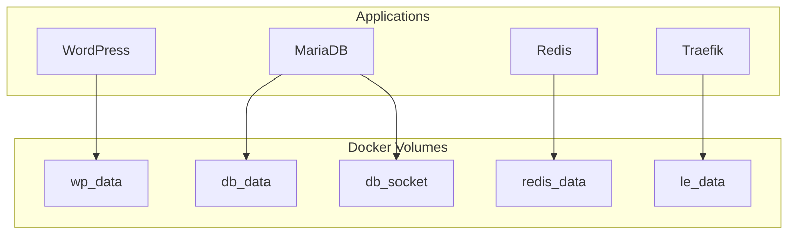

**Volume Purposes**:

- `wp_data`: WordPress files and uploads
- `db_data`: MariaDB data files
- `db_socket`: MySQL socket files
- `redis_data`: Redis cache data
- `le_data`: Let's Encrypt certificates

## Local Development Architecture

### Simplified Setup

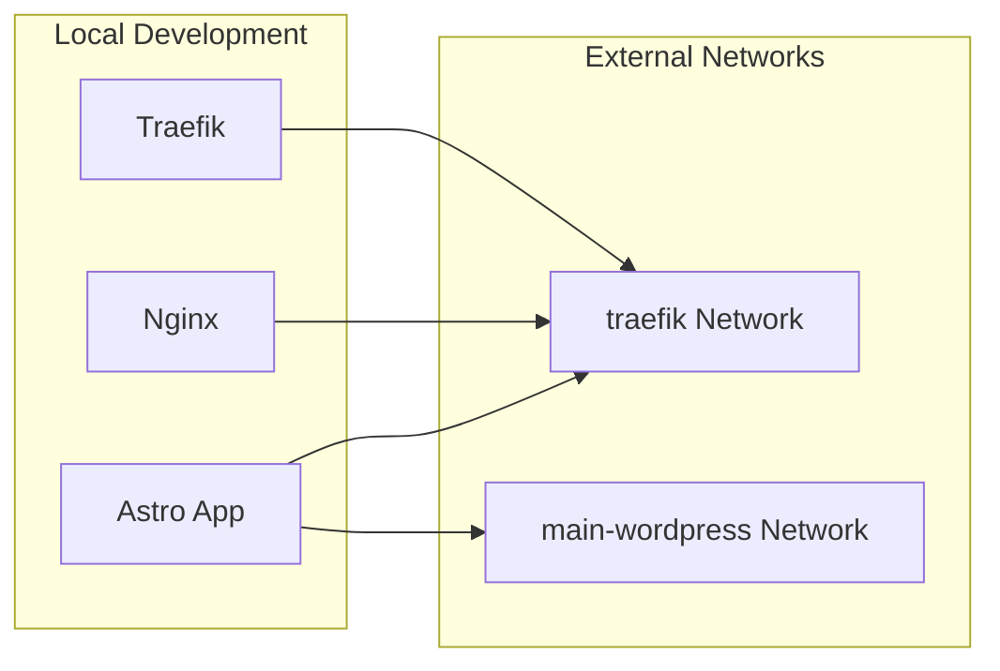

**Key Differences from Production**:

- No SSL termination (HTTP only)
- Simplified network configuration
- Direct port exposure for development
- Hot-reload capabilities
- External WordPress network connection

**Services**:

- **Traefik**: Basic routing without SSL
- **Nginx**: Simple reverse proxy
- **Astro**: Development build with hot-reload

## Archive Architecture

### Legacy Application Support

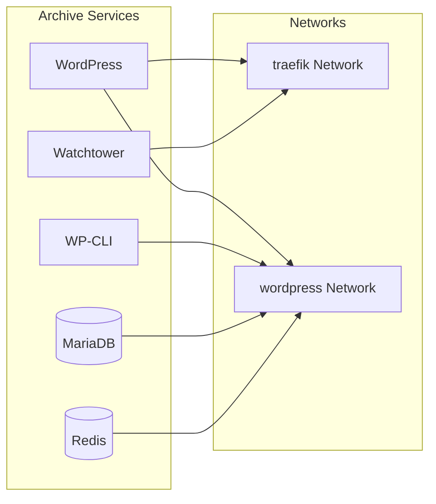

**Purpose**: Host legacy applications and archived content
**Features**: Similar to production WordPress stack but for archived content

## Network Architecture

### Network Segmentation

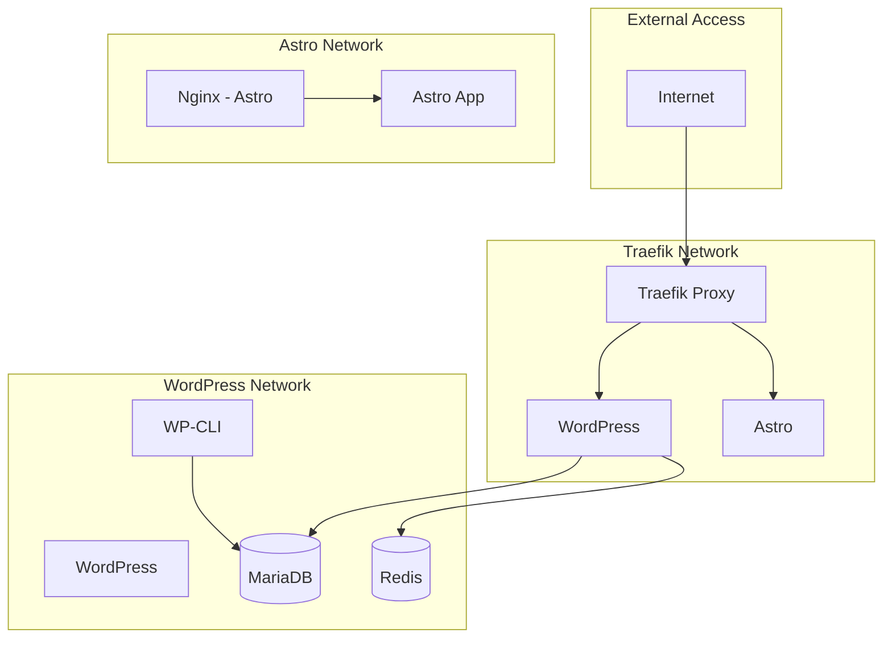

**Network Configuration**:

- **traefik**: External-facing network for all services
- **wordpress**: Internal network for WordPress stack (10.5.0.0/24)
- **astro**: Internal network for Astro application

**Security Benefits**:

- Service isolation
- Controlled inter-service communication
- Static IP addressing for internal services

## Data Flow

### Request Flow Diagram

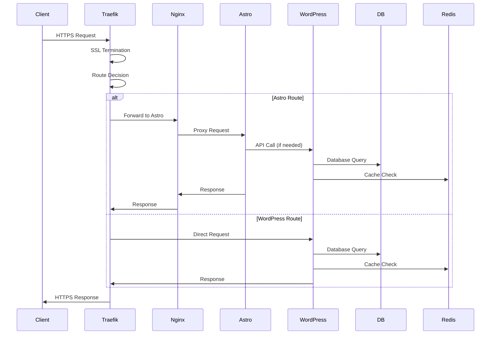

### API Integration Flow

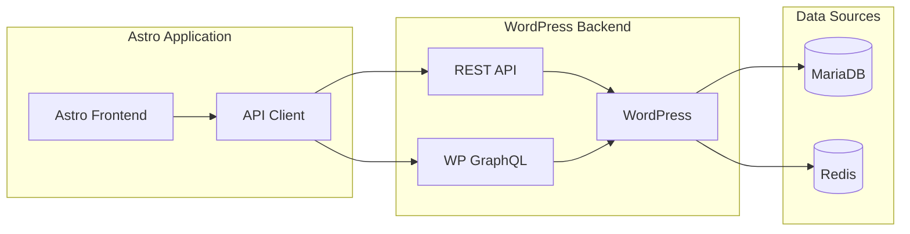

## Security Considerations

### Security Architecture

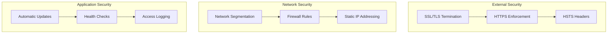

**Security Features**:

- Automatic SSL certificate management
- Network segmentation and isolation
- Health monitoring and automatic restarts
- Access logging and monitoring
- Automatic security updates via Watchtower

## Deployment Strategy

### Deployment Pipeline

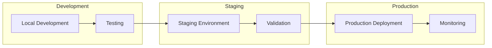

### Environment Variables

**Production Environment**:

```bash
# Required Environment Variables
COMPOSE_PROJECT_NAME=mathcom
NGINX_HOST=math.sc.chula.ac.th
NGINX_PATHPREFIX=/
DB_NAME=wordpress
DB_USER=wordpress
DB_PASS=secure_password
LE_EMAIL=admin@math.sc.chula.ac.th
PUBLIC_API=https://math.sc.chula.ac.th/wp-json/wp/v2
PUBLIC_INTERNAL_API=https://math.sc.chula.ac.th/wp-json/wp/v2
```

**Local Environment**:

```bash
# Development Environment Variables
PUBLIC_API=http://localhost/wp-json/wp/v2
PUBLIC_INTERNAL_API=http://localhost/wp-json/wp/v2
```

## Monitoring and Health Checks

### Health Monitoring Architecture

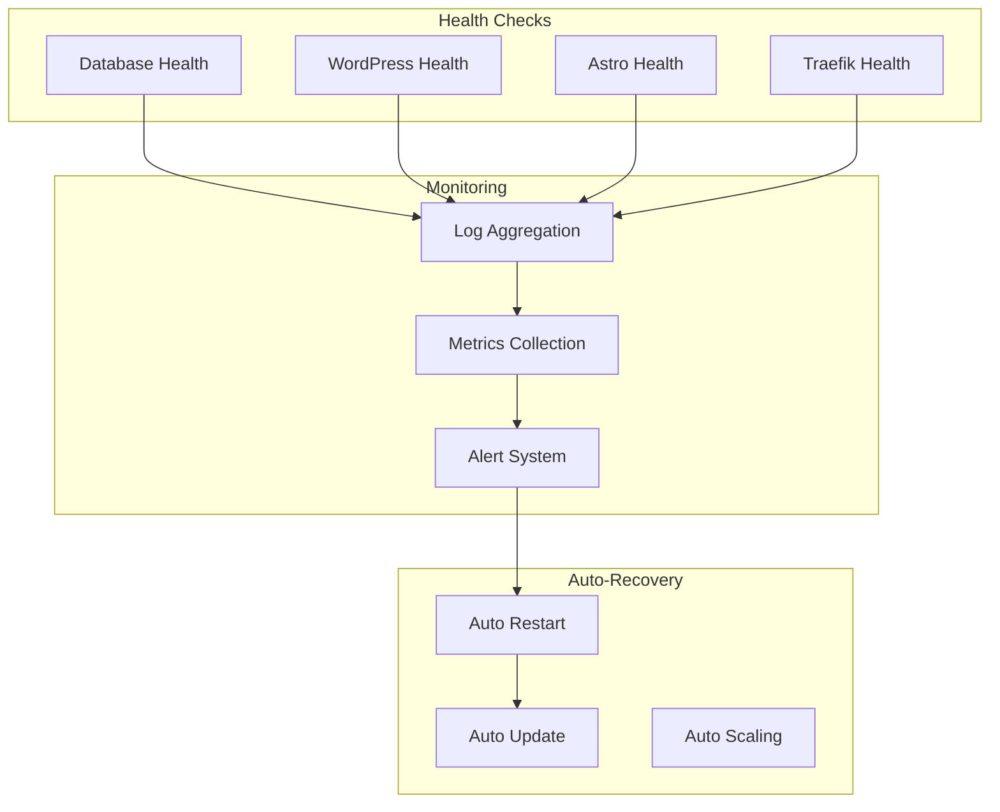

**Monitoring Features**:

- Database health checks with automatic restart
- Service health monitoring
- Automatic container updates via Watchtower
- Comprehensive logging
- Performance metrics collection

## Troubleshooting Guide

### Common Issues and Solutions

#### 1. Service Startup Issues

**Problem**: Services fail to start
**Solution**:

```bash
# Check service logs
docker compose -f docker/production/main/wordpress/docker-compose.yml logs

# Verify network connectivity
docker network ls
docker network inspect traefik

# Restart services in dependency order
docker compose -f docker/production/main/proxy/docker-compose.yml up -d
docker compose -f docker/production/main/wordpress/docker-compose.yml up -d
docker compose -f docker/production/main/astro/docker-compose.yml up -d
```

#### 2. SSL Certificate Issues

**Problem**: SSL certificates not generating
**Solution**:

```bash
# Check Let's Encrypt volume
docker volume ls | grep le_data

# Restart Traefik
docker compose -f docker/production/main/proxy/docker-compose.yml restart traefik

# Check Traefik logs
docker compose -f docker/production/main/proxy/docker-compose.yml logs traefik
```

#### 3. Database Connection Issues

**Problem**: WordPress cannot connect to database
**Solution**:

```bash
# Check database health
docker compose -f docker/production/main/wordpress/docker-compose.yml exec db mysql -u root -p

# Restart database
docker compose -f docker/production/main/wordpress/docker-compose.yml restart db

# Check database logs
docker compose -f docker/production/main/wordpress/docker-compose.yml logs db
```

#### 4. Performance Issues

**Problem**: Slow response times
**Solution**:

```bash
# Check Redis cache
docker compose -f docker/production/main/wordpress/docker-compose.yml exec redis redis-cli

# Check Nginx cache
docker compose -f docker/production/main/wordpress/docker-compose.yml exec nginx nginx -t

# Monitor resource usage
docker stats
```

### Emergency Procedures

#### Complete System Reset

```bash
# Stop all services
sudo docker stop $(sudo docker ps -aq)

# Remove all containers
sudo docker rm $(sudo docker ps -aq)

# Clean networks
sudo docker network prune -f

# Restart Docker daemon
sudo systemctl restart docker

# Recreate networks
sudo docker network create traefik
sudo docker network create wordpress
sudo docker network create astro

# Restart services
docker compose -f docker/production/main/proxy/docker-compose.yml up -d
docker compose -f docker/production/main/wordpress/docker-compose.yml up -d
docker compose -f docker/production/main/astro/docker-compose.yml up -d
```

---

## Summary

The MathCom web application uses a sophisticated Docker-based microservices architecture that provides:

- **High Availability**: Multiple services with health checks and auto-restart
- **Security**: SSL termination, network segmentation, and automatic updates
- **Scalability**: Modular design allowing independent scaling of services
- **Maintainability**: Clear separation of concerns and comprehensive monitoring
- **Flexibility**: Support for multiple environments (production, development, archive)

The architecture successfully combines modern web technologies (Astro.js) with traditional CMS capabilities (WordPress) while maintaining high performance and security standards through proper containerization and orchestration.
